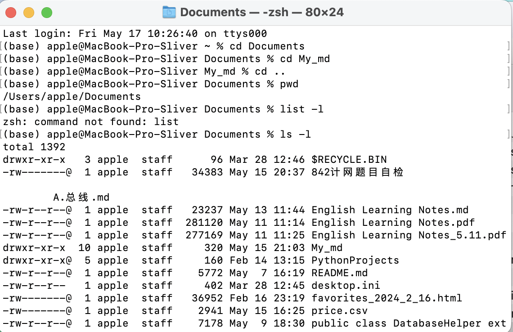
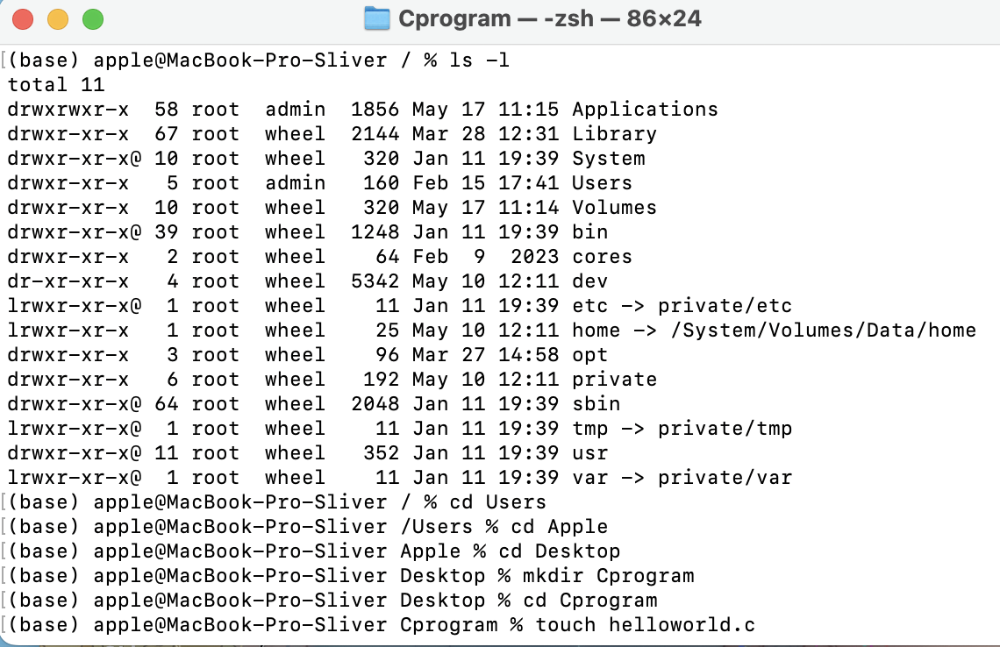
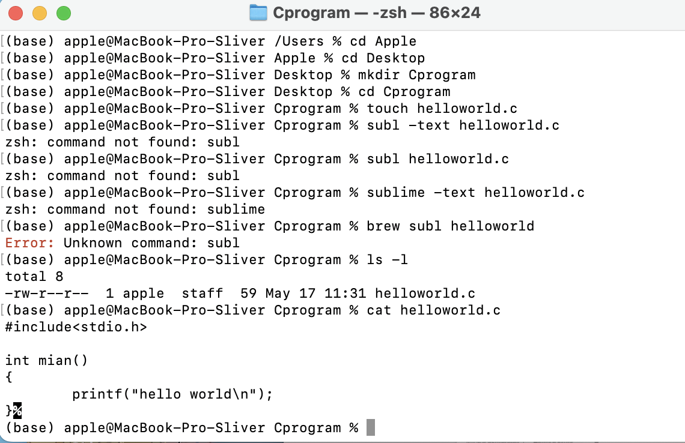
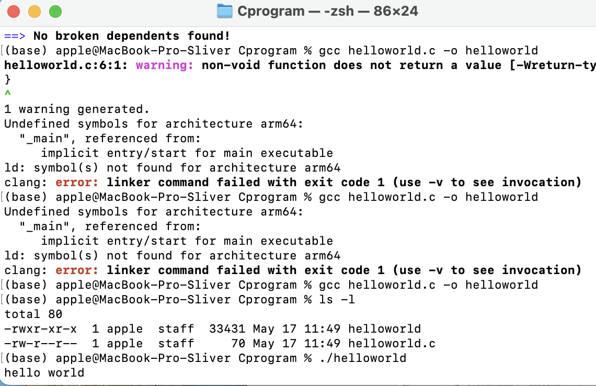

# Basic preparation

## gcc

```shell
sudo apt install gcc
```

- `sudo` : Super User do
- `apt` : **Advanced Package Tool**,simplify the installation, upgrade,and delete.


## File command

```
ls -l
```

- `ls -l` : list all files in the **current directory** in the form of list-items.

  

```shell
cd directory-name
```

- `cd` : go into the directory which you appoint (the son directory)


```shell
cd ..
```

- `cd ..` : go back to the parent directory


```shell
cd /
```

- `cd home` : go back to the root directory


```shell
pwd
```

- `pwd`: show the current path 




```shell
rm -rf directory-name
```

- `rm`: remove
- `rf`: 
  - r : recursive
  - f : force
- `rm -rf` force to delete all the files in the appointed directory and the directory


```shell
mkdir dir-name
```

- `mkdir`: make a new dir


```shell
touch filename
```

- `touch`: create a file




```shell
cat helloworld.c
```

- `cat`: check the content of the appointed file




```shell
gcc helloworld.c
```

- Gcc : complie the C file , create an 'a.out' file

  ```shell
  gcc helloworld.c -o helloworld
  ```

  Compile the helloworld.c and create an execuable file called 'helloworld'


```shell
./helloworld
```

- `./`: execute the file you pass in
  - `r` : read
  - `w` : write
  - `x` : execute



