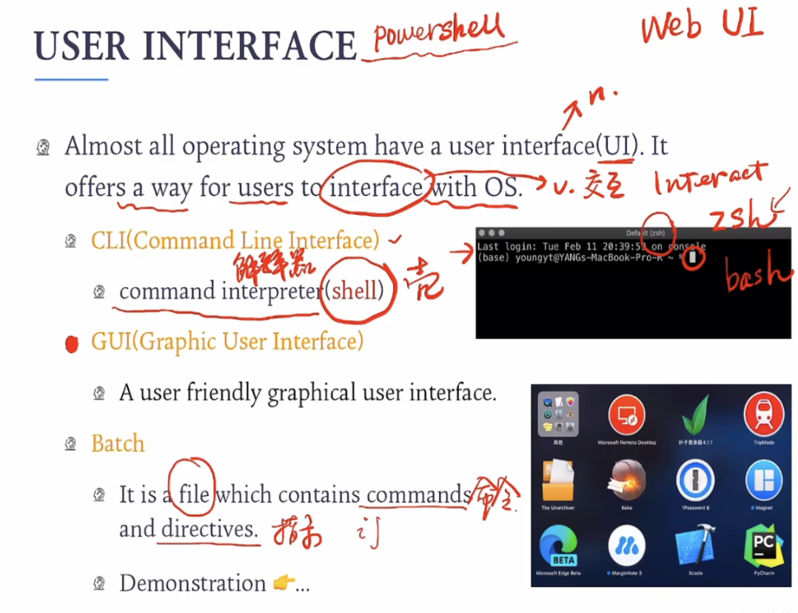

# Service of OS 

## What service do OS supply

## User Interface

- Command Line Interface
  - you can text your command to conduct tasks
- GUI
  - User fridenly graphical user interface
  - just click or drag or press your button on computer
- Batch
  - a file which contains commands and directives（ a batch of commands）.

## Standard C program

- `Step1:`when approaches the line which contains API `'printf()'` which is supplied by `C library`, mode will be transfer to Kernel model which `kernel` exists.
- `Step2:` In kernel, OS call `system call` called `'write()'` , which writes information on user's screen.
- `'write()'`returns a value (the amount of bytes has been written) to user's program.

## Dual mode

### Why needs Dual mode?

> When converting mode to another, we change the `access` to resources like file,memory,or other device.
>
> IF we still hold our position in User Mode, we can't access some `sensitive resources` which could cause error and other problems.
>
> When in Kernel, Kernel can operate OS codes which can use system call. This bestow Kernel more `Advanced permissions` like change system settings or change file access.

### When transfer?

## implements process of system call

- `Exclusive numerical symbols`
  - make system call more accuracy, and less mistakes
- `index table`
  - Make system call quickly, more efficiently.

# Organization of OS

## Introduction: Multics System

- `Benefits:`
  - Resources can be divided into several segments for different user's requirements.
  - Make operations more safer 

### caused problems:

Naturally, it leads to our question: how to design a OS?

## Design ideas of OS

- Goal
  - user's goal
  - system goal
- Division of mechanism and policy
  - `Policy: what to do ?` How should system reacts different requirements?
    - decide the acting methods of system, contains high-level abstractions, like resources management, access management.
    - For example, when schedule cpu, we may think more about the task which owns higher priority. That is CPU's policy.
  - `mechanism: do what` 
    - The tool to implement policy, tell us the specialist way to implements policy.
    - For example, the algorithm we use in CPU schedule, like Time Slice Round-Robin, which implements the policy of CPU schedule.
  - `Microkernel`
    - Modularizing the `core functions` of an operating system places the vast majority of operating system services to run in user space, leaving only the `most basic functions in kernel space`. The microkernel usually includes a small number of core services, such as process management, memory management and thread scheduling, while other services are implemented in user space, such as the file system, the network protocol stack, and so on.
    - The reason why we need it:
      - moduel and extension
      - stability and security
      - Performance optimization

 

# GNU / LINUX

