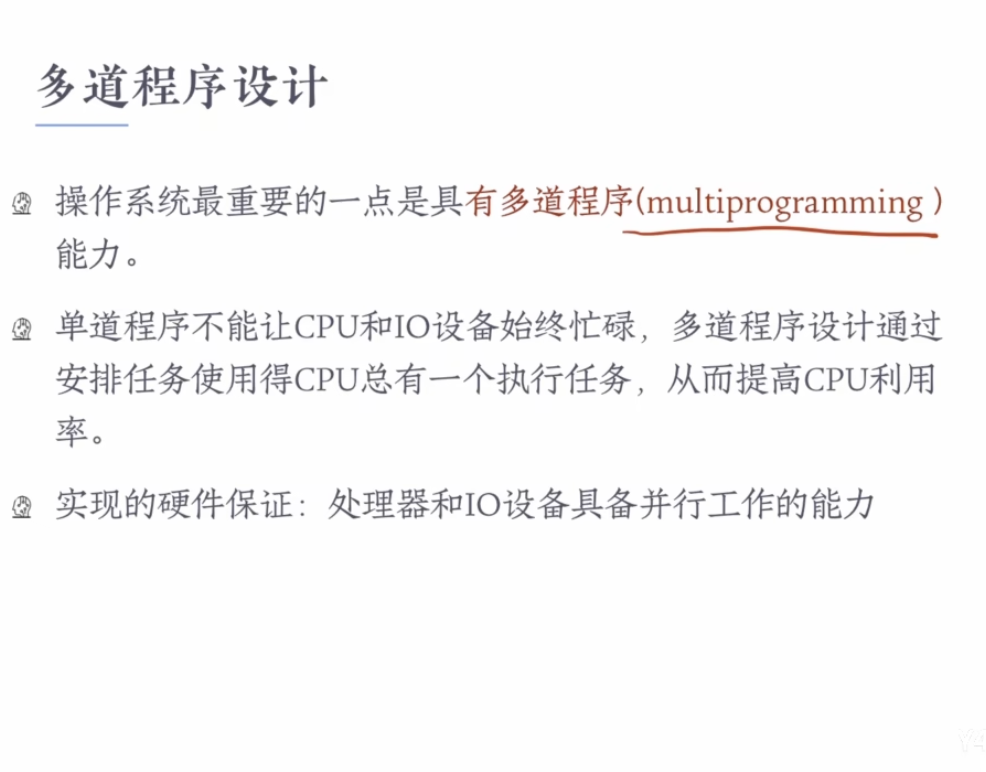
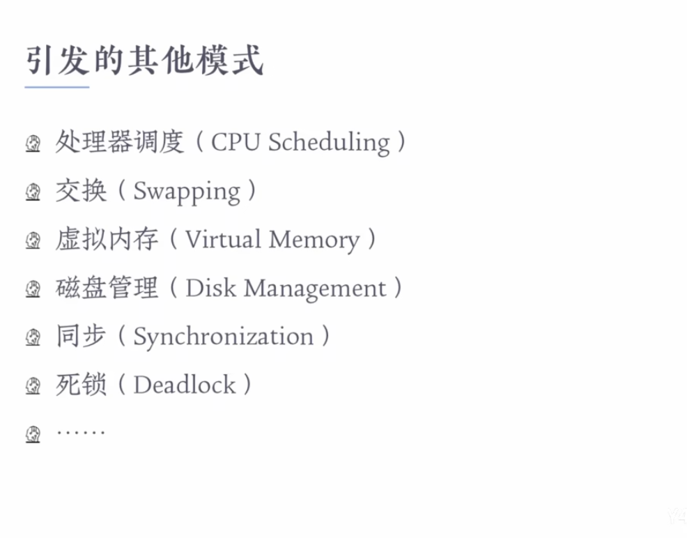

# Introduction

### What we need to learn is:

- linux operating-system

- Process Manage
- Memory Manage
- Storage Manage

- In/out system

  

### Why need OS?

> OS conbine what consist computer-system like  hardware、data and software to organize them

### COMPUTER SYSTEM hierarchical structure

Operating System exists in a specialist place which between `system and applications programs` and `computer hardware`, as a result, OS is an interface.

#### Interface definition

Interface is `the boundary` connects two creatrues, through interface we can make `significant dialogue` between the both sides.

- Hardware - hardware 
  - USB / VGA / HDMI / THUNDER

- Software - hardware
  - CPU can use Instructions to conduct operations
- Software - software
  - Printf(a) in C language
  - printf is `application programming interface(api)` ,which implements the function of print sth. on screen using C. 

### Virtual machine

OS supply a 'computer' which can be better understanded and used, called 'Vitual Machine'. VM is not a really computer, but a special computer can be used by users.

When users conduct their tasks on this VM, OS transfer `user's operations on VM` to `Physical Machine(hardware)`.

### Function of OS

- User perspective
  - friendly GUI
  - Standard  function library
  - make programming more reachable and less mistakes
- Computer perspective 
  - manage resource
    - hardware
    - information resource
  - Resolve contradictions
  - prevent errors from damaging computer

### define OS

- An `operating system` acts an `intermediary` between user of a computer and the computer hardware.
- The purpose of an OS is to provide an `environment` in which a user can execute programs in a `convenient` and `efficient` manner.
- An OS is `software` that manages the computer hardware.

# Computer system organization

Q:which component does OS reside on?

A: DISK

## BOOT

### BOOT SECTOR

### BOOTSTRAP

### Interrupt

## Storage system

### definition

### hierarchical structure

## I/O structure

### importance

# Computer system architecture

## Single-processor system

`only one main CPU` 

## Multi-processor/Multicore System

- AM: Main CPU and assistant CPU
- SMP: All CPU play equal roles

## Clustered System

- High availability : A condition in which a system or service can continue to operate normally over a long period of time with little disruption or downtime.
- High-performance computing : quick reflect / efficient performance.
- Loosely coupled : one node breaks will not contribute the damage to other nodes.

# OS structure

## Single-User and Single-Programming  Model

In this model, we spend too much time on I/O, but CPU is not always on use.

## Multi-Programming

## Time-Sharing / Multi-Tasking

## Introduced problems...

