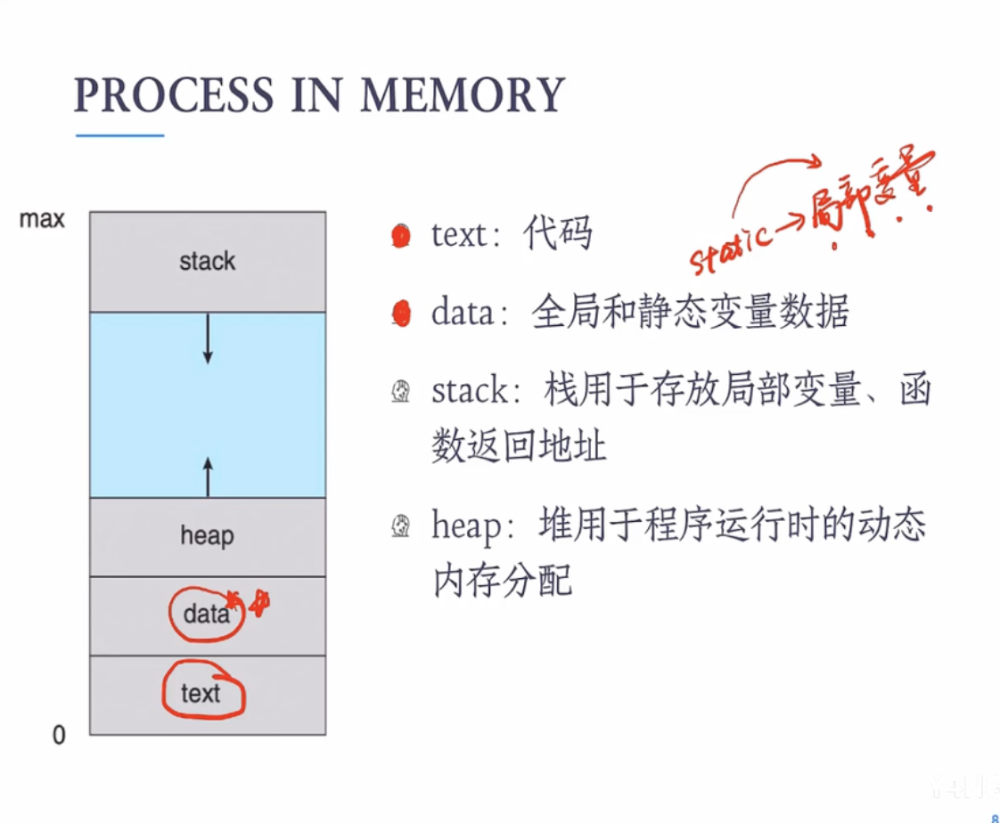
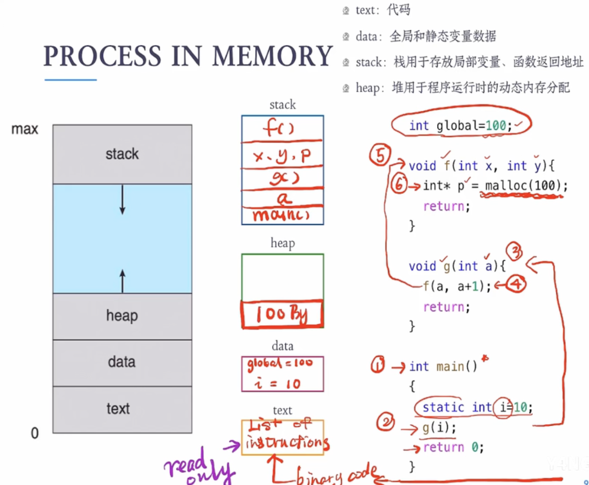
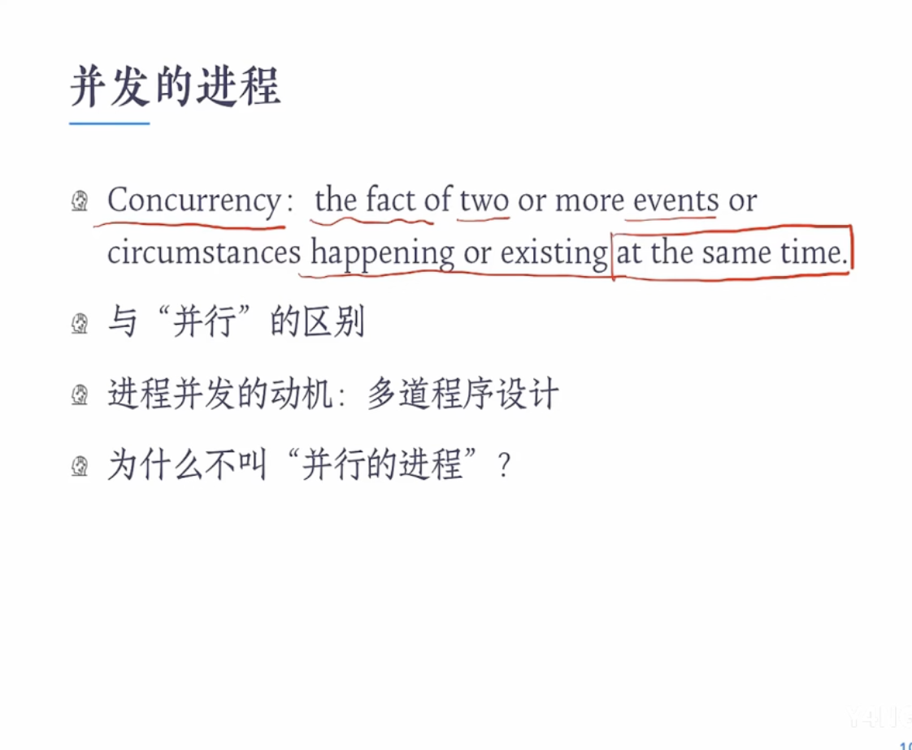
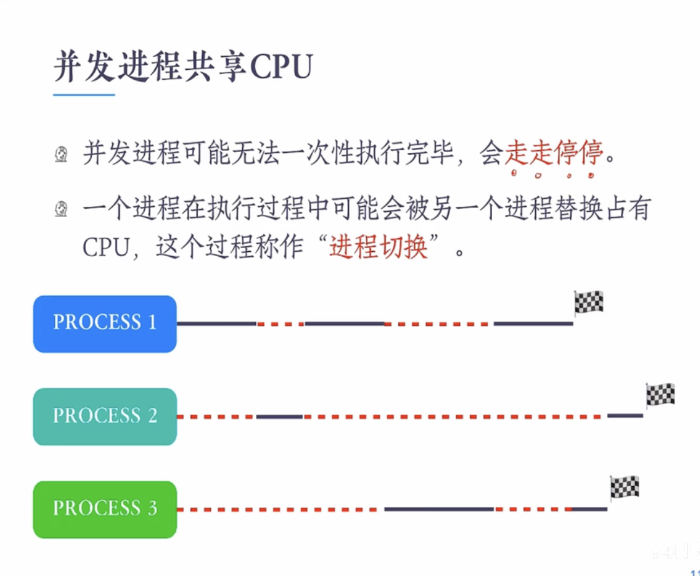
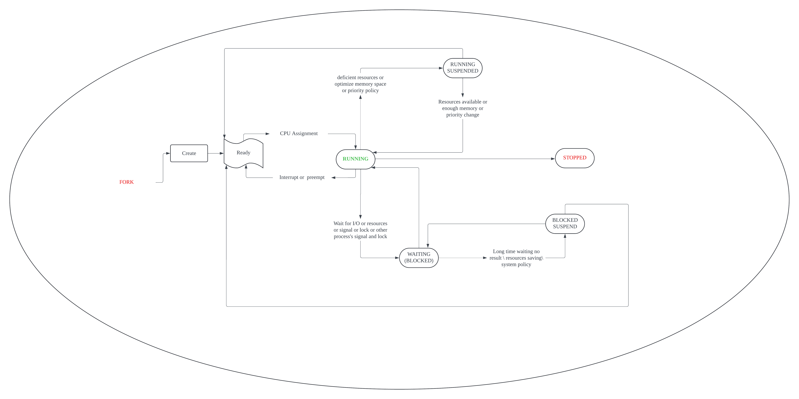
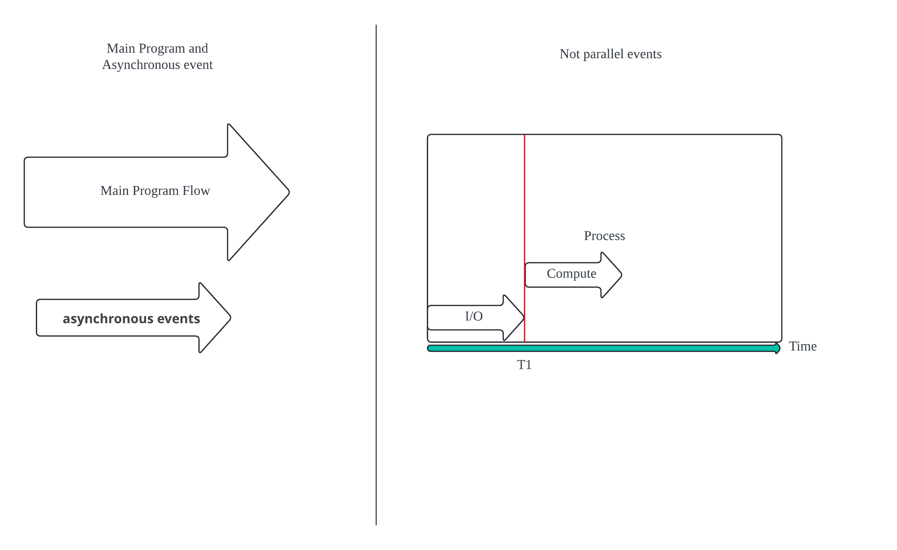

# Program and Process

## Definination

> ### Program

 Program is a **passive entity** , such as a file which contains a list of instructions stored on disk(often called an **excutable file**)

 (**'passive entity'** means that it can passively runned by users or programmers)

> ### When Program Become Process

A program becomes a process when an executable file is **loaded into** **memory**

> ### Process

1. `A process is an active entity`, with a **program counter** specifying the next instruction to execute an set of associated resources.
2. `Process is the running process of a program:`

- should implements some specific functions
- is based on the set of data
- the running process is Concurrent

3. `Process is the basic unit of the assignment, protection and control of resources`in OS. 

> ### Program Counter

Program counter is a register which stored the next instruction's address.

When CPU finishes an instruction, the register make **address + 1** ('1' is the capacity of a pointer)

## Process in memory

- Text : store code
- data : store global and static variables

- heap : assign the run-time dynamic memory
- Stack : store the local variables and the return address of functions

### The process of the program with explanation

- After the program is complied, list of instructions is stored in text.

- The entrance of this program is 'main()'. When this program is loaded into the memory, firstly the return address of 'main()' should be stored in stack.                                                                            Global variable 'global' and static variable 'i' should be stored in 'data', where contains the global and static variables.

- As we approach the line of 'g(i)', we will access the function 'g()'. 
  Then the local variable 'a' and the return address of 'g()' comes into stack.
- In the Function 'g()' , we can perceive that there is a line contains 'f()' , naturally we should access to 'f()', so the x,y,p and the return address of 'f()' also come into stack.                                                              
  And in f(), 100 bytes of dynamic memory is allocated. So the section of heap should also assgin 100 bytes.
- As the program running step by step, the content in stack come out from the top to the button and is been freeed.

## Concurrency and Parallel

> ### Concurrency :
>
> two or more events or circumstances **happening or existing** at the same time.

> ### Parallel:
>
> two or more events or circumstances **running** at the same time.

We can conclude that Concurrency means events are not running at the same time. For instance, processes will Concurrenctly running when we only own one CPU.

### Concurrency Process Share the CPU

## Process State

- **RUNNING** : is running on CPU
- **READY** : has the circumstance to run, and wait for the assignment of CPU resources
- **WAITING** : is waiting for some specific events to happen, has no exact circumstance to run.
  The event maybe the accomplishment of IN/OUT operations.
- **Suspend** : When a process is temporarily(临时) removed from the main memory and is stored on the disk **to free up memory,** it is said to be in a suspended state. The process is not actively executing, and its memory space is saved on the disk.
  When the process is needed again, it is loaded back into the main memory and resumes execution.
- **Stopped**(**Terminated ):** The terminated state is reached when a process completes its execution or terminates by the operating system. In this state, the process no longer uses any system resources, and its memory space is deallocated.

### Explanation of Interrupt and preempt

#### INTERRUPTS

- Interrupts are signals triggered by events **external to the processor** that interrupt the flow of execution of the current process. 

  Interrupts can be broadly divided into two categories:

  - `Hardware INTERRUPts:` INTERRUPT signals GENERATED by peripheral devices, such AS when an input/OUTPUT device completes an operation, OR caused by a hardware failure.

  - `Software interrupts:` caused by the execution of specific instructions, such as system calls, exception production (such as division by 0, access to invalid memory), other control signals, etc.

- The purpose of interrupts is to **enable the processor to respond to and process high-priority events**(such as the emergent errors), ensuring that the system can react to external changes or the needs of internal operations in a timely manner.

#### PREEMPT

- Preemption is a mechanism **used by multitasking operating systems** to **ensure fair distribution of processor time,** **respond to real-time tasks, or maintain system stability**.
  

  Preemption may be triggered by:

  - `Running out of Time Slice:` In a time-sharing operating system, each running process is assigned a certain time slice, and when the time slice is used up, the operating system will preempt the CPU control and give it to another process.

  - `Higher-priority process ready:` If a higher-priority process changes from a blocked state to a ready state, the operating system may preempt the currently running lower priority process to perform more urgent tasks.
  - `Resource management:` In order to **ensure that critical system tasks can be executed in a timely manner**, the operating system may implement preemption to release resources occupied by lower priority tasks.

- Preemption **ensures the flexibility** and **fast response** of the operating system **for processing resources and task priority management**(important tasks).

#### Conclusion

Interrupts are usually triggered by **asynchronous events(异步事件)** and can occur at any time. Preemption is usually caused by the internal scheduling mechanism of the system, for the purpose of fair scheduling of tasks or in response to the needs of higher priority tasks.

#### Difference of asynchronous events and not-parallel events

Asynchronous events are those that occur **independently of the main program flow**, do not block the main program from performing other tasks, and can occur at any point in time. "not parallel" is used to describe transactions or events that do not happen at the same time.

To summarize more accurately:
- **Asynchronous events  :** are independent of the main execution flow and can be processed in parallel without directly interfering with the continued execution of the main flow.
- **Parallel events  :** Multiple events or tasks occur and process at the same time.

So, asynchronous events may or may not be parallel, and parallelism describes only how the event happens, whereas asynchronous describes the nature of the relationship between the event and the main process.

